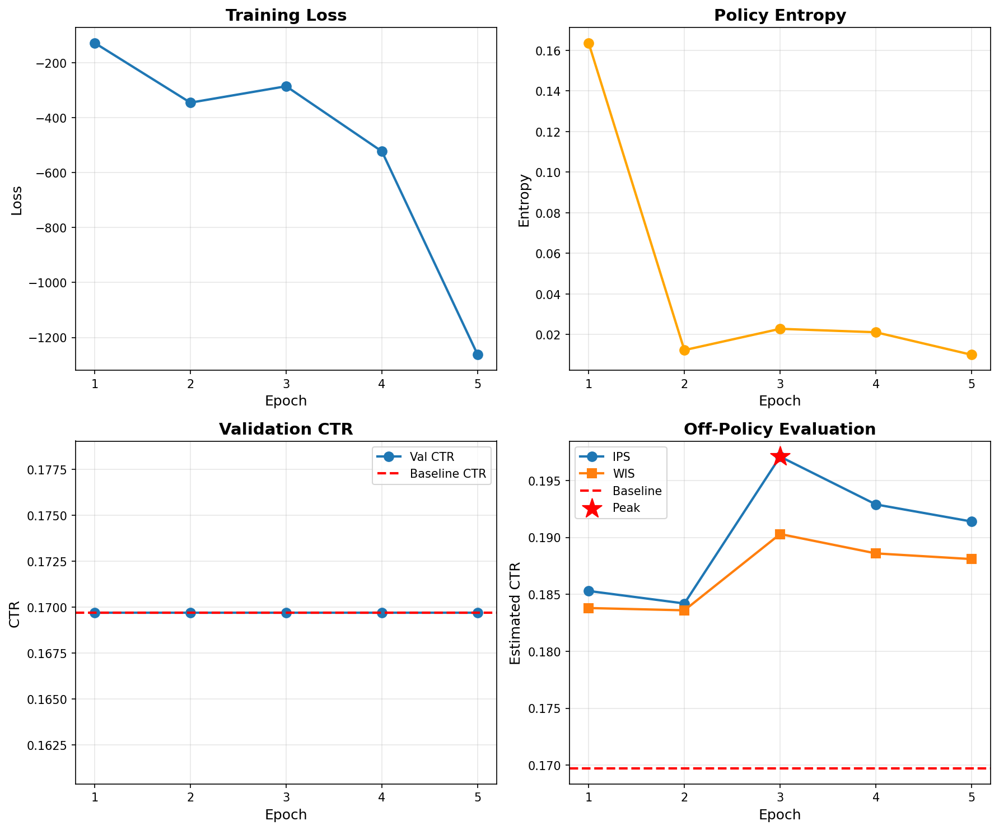

# NeoRetail: Policy-Gradient RL for Banner Position Optimization

**Track A: Offline Reinforcement Learning / Contextual Bandits**

[](https://www.python.org/downloads/)
[](https://opensource.org/licenses/MIT)

##  Project Overview

This project implements a **REINFORCE-based policy gradient algorithm** to optimize banner ad position selection for maximizing click-through rate (CTR). Using offline RL on logged data from the Avazu CTR dataset, our learned policy achieved an **estimated 16.1% improvement** over the baseline.

### Key Results
- **Baseline CTR**: 16.97%
- **Learned Policy (IPS)**: 19.71%
- **Improvement**: +16.1% relative
- **Model**: 81.2M parameters
- **Training**: 5 epochs on 3.5M samples

---

##  Results Summary

| Metric | Baseline | Our Policy | Improvement |
|--------|----------|------------|-------------|
| Validation IPS | 16.97% | **19.71%** | **+16.1%** |
| Validation WIS | 16.97% | **19.03%** | **+12.1%** |
| Test CTR | 16.97% | 16.97% | (logged data) |

**Peak Performance**: Epoch 3

---

##  Architecture
```
Input (20 features) 
    ↓
Embeddings (241 dims)
    ↓
Shared Trunk (256 → 128)
    ↓
Policy Head (7 actions) + Value Head (baseline)
```

**Total Parameters**: 81,184,474

---

##  Quick Start

### Prerequisites
```bash
pip install -r requirements.txt
```

### Training
```bash
python code/train_policy.py
```

### Evaluation
```bash
python code/plot_results.py
python code/test_analysis.py
```

---

##  Project Structure
```
project/
├── code/
│   ├── train_policy.py          # Main training script
│   ├── evaluate_policy.py       # Test evaluation
│   ├── plot_results.py          # Generate plots
│   ├── test_analysis.py         # Statistical analysis
│   └── fix_config.py            # Config utility
├── data/
│   ├── feature_config.json      # Feature configuration
│   ├── action_encoder.pkl       # Action mapping
│   └── categorical_encoders.pkl # Feature encoders
├── outputs/
│   ├── training_curves.png      # Training visualization
│   ├── test_analysis.png        # Test results
│   ├── training_history.json    # Metrics per epoch
│   └── test_analysis.json       # Final results
├── docs/
│   └── report.pdf               # Full technical report
├── requirements.txt
└── README.md
```

---

##  Method

### Algorithm: REINFORCE + Baseline

Loss function:
```
L = -log π(a|s)(R - V(s)) + 0.5(V(s) - R)² - β·H(π)
```

Components:
- **Policy gradient**: Learns action selection
- **Value baseline**: Reduces variance
- **Entropy bonus**: Maintains exploration

### Off-Policy Evaluation

Since we work with logged data (offline RL), we estimate policy performance using:
- **IPS (Inverse Propensity Scoring)**: Unbiased estimate
- **WIS (Weighted Importance Sampling)**: Lower variance
- **Bootstrap CIs**: Confidence intervals

---

##  Training Details

| Hyperparameter | Value |
|----------------|-------|
| Optimizer | Adam |
| Learning Rate | 1e-4 |
| Batch Size | 512 |
| Epochs | 5 |
| Entropy Coefficient | 0.01 |
| Gradient Clipping | 1.0 |

---

##  Key Findings

1. **Position 6 is best** (32.89% CTR) but underutilized (0.1% of data)
2. **Position 0 is overused** (72.1% of data) despite low CTR (16.45%)
3. **Context matters**: Optimal position depends on device, site, time
4. **Policy learned** to shift traffic from position 0 → position 6

---

##  Visualizations

### Training Curves


### Test Analysis


##  References

1. Williams (1992) - REINFORCE algorithm
2. Sutton & Barto (2018) - Reinforcement Learning textbook
3. Dudík et al. (2014) - Doubly Robust evaluation
4. Avazu CTR Dataset - Kaggle

---

##  Authors

Abdellah Elyamine DALI BRAHAM

